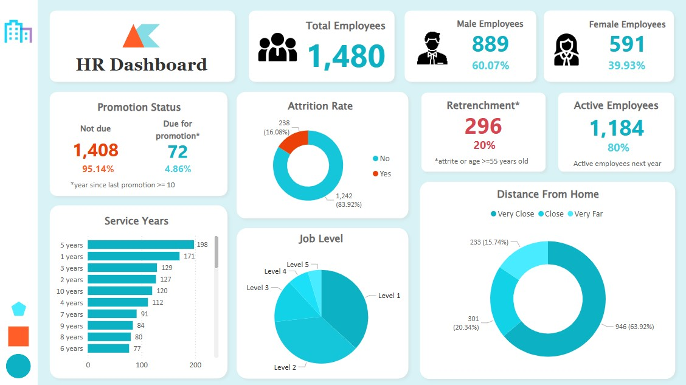

# HR Analytics Dashboard (Power BI)

## 📊 Project Overview
This repository contains an interactive **HR Analytics Dashboard** built using **Power BI**. The dashboard provides insights into key HR metrics, helping organizations analyze employee data effectively. The dataset used is sourced from [Kaggle - HR Analytics Dataset](https://www.kaggle.com/datasets/saadharoon27/hr-analytics-dataset).

## 📁 Dataset Information
The dataset includes the following key attributes:
- Employee ID
- Gender
- Attrition Status
- Years at Company
- Promotion Status
- Service Years
- Job Level
- Distance From Home

## 📌 Dashboard Features
- **Employee Demographics by Gender**: Analyze the gender distribution across the workforce.
- **Promotion Status**: Track employees' promotion status (Not Due, Due for Promotion).
- **Service Years**: Visualize the distribution of employees based on their years of service.
- **Job Level**: Breakdown of employees by job levels (Level 1-5).
- **Attrition Rate**: Measure and analyze employee attrition trends across departments and job roles.
- **Retrenchment**: Identify and track employees affected by retrenchment.
- **Active Employees**: Monitor the number of currently active employees.
- **Distance from Home**: Analyze employees' commute distance and its impact on other metrics.

## 🛠️ How to Run the Dashboard
1. **Download the Dataset**: Ensure you have the HR Analytics dataset from Kaggle.
2. **Open Power BI**: Install and launch Power BI Desktop if you haven't already.
3. **Load the Data**: Import the dataset into Power BI.
4. **View Dashboard**: Open the provided `.pbix` file to explore the dashboard.

## 📊 Dashboard Preview

## 🧰 Tools Used
- **Power BI Desktop**: For data visualization and dashboard creation.
- **DAX (Data Analysis Expressions)**: For creating calculated measures and columns.
- **Power Query**: For data transformation and cleaning.

⭐️ Don't forget to star the repository if you find it useful!

